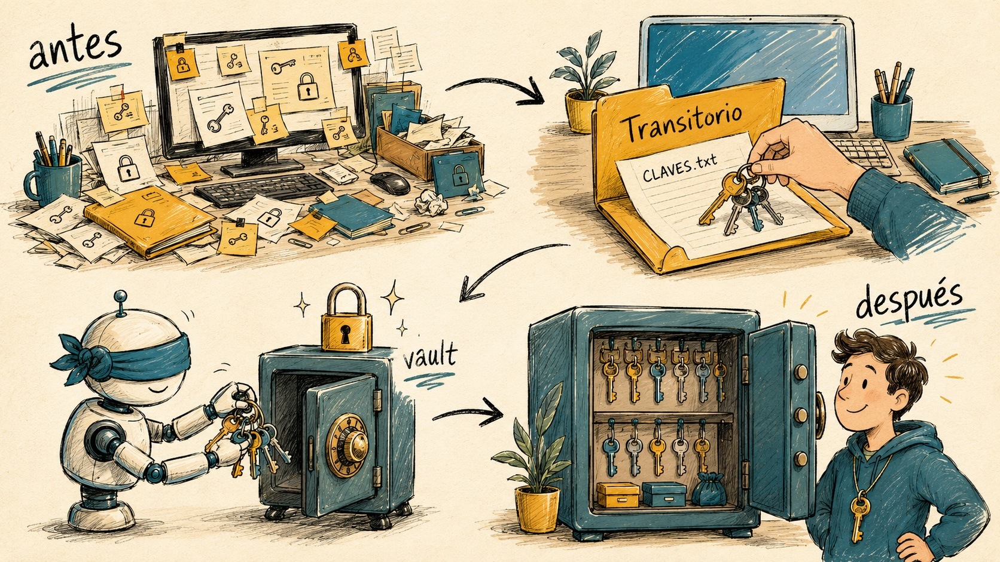

# VAULT-Privado



**Caja fuerte local de credenciales para trabajar con asistentes de IA
(Claude Code, Codex, etc.) sin tener ni una contraseña en texto plano.**

Solo macOS por ahora. Gratis, sin cuentas, sin servidores, sin depender de
nadie: usa el Llavero (Keychain) nativo de tu Mac.

---

## El problema (que casi nadie ve)

Si trabajas con un asistente de IA en tu ordenador, lo normal acaba siendo
esto: contraseñas SSH en un `accesos.txt`, API keys pegadas en un `.md`,
archivos `.env` con todo en claro repartidos por los proyectos. Eso tiene tres
agujeros:

1. **Secretos en claro en disco** — cualquier programa que corra con tu
   usuario puede leerlos. Un archivo con TODO junto es el premio gordo.
2. **Volcado al contexto de la IA** — cada vez que tu asistente "lee el
   archivo de claves para ponerse en contexto", todas tus credenciales viajan
   a la conversación.
3. **Transcripts** — las sesiones de los agentes se guardan en disco. Si el
   secreto pasó por la conversación, ahora vive también en cada transcript.

VAULT-Privado ataca los tres.

## Cómo funciona

- **Llavero dedicado y aislado**: se crea un llavero macOS propio
  (`vault-privado`), separado de tu llavero `login` personal (donde están tu
  banca, tus certificados...). Tu IA solo opera contra el llavero dedicado;
  el personal no se toca jamás. Cifrado en reposo por el sistema, contraseña
  maestra que solo conoces tú, autobloqueo a la hora.
- **Índice sin secretos**: en cada proyecto queda un `CREDENCIALES.md` que
  dice QUÉ credenciales existen y CÓMO se llaman en el llavero — nunca sus
  valores. La IA (y tú) siempre sabéis dónde mirar.
- **Lectura granular**: la IA lee un secreto concreto cuando lo necesita,
  nunca el almacén entero.
- **`vault run` — la pieza clave**: ejecuta un comando con el secreto
  inyectado como variable de entorno al proceso hijo. El valor **nunca pasa
  por la conversación ni por los transcripts**:

  ```bash
  vault run vault/miproyecto/SSH_PASSWORD --as SSHPASS -- sshpass -e ssh usuario@servidor
  ```

- **Tú lo ves todo visualmente**: abre la app **Acceso a Llaveros** (Spotlight
  → "Acceso a Llaveros"), clic en el llavero `vault-privado`, tu contraseña
  maestra, y ahí está tu bóveda: ver, añadir y borrar con doble clic, sin
  terminal.

## Instalación

Dile a tu asistente de IA:

> Clona https://github.com/flopez1977/VAULT-Privado, ejecuta su `install.sh`,
> y añade el contenido de `PARA-TU-IA.md` a tus instrucciones.

O a mano:

```bash
git clone https://github.com/flopez1977/VAULT-Privado
cd VAULT-Privado && ./install.sh
```

El instalador:

1. Copia la CLI a `~/.vault-privado/bin` y crea el alias `vault`.
2. Crea la carpeta **Transitorio** en tu Escritorio con un `CLAVES.txt` virgen.
3. Deja en `~/.vault-privado/PARA-TU-IA.md` las instrucciones para tu asistente.
4. Te indica el único paso que haces tú: crear el llavero con TU contraseña
   maestra (dos líneas en Terminal; ni el instalador ni la IA la conocen nunca).

## El flujo estrella: la carpeta Transitorio

Para no tener que aprender ningún sistema:

1. Abre `Escritorio/Transitorio/CLAVES.txt` y pega ahí las claves de un
   proyecto, en el formato natural `Etiqueta: valor`:

   ```
   Servidor: 203.0.113.10
   Usuario SSH: miusuario
   Password SSH: laquesea
   API Key: xxxxxxxxxxxx
   ```

2. Dile a tu IA: **"Te he dejado las claves del proyecto X en el Transitorio"**.

3. Tu IA, siguiendo `PARA-TU-IA.md`:
   - importa todo al llavero **verificando cada valor por hash** y sin
     imprimir nunca los valores (los importadores solo muestran nombres);
   - si hay una clave SSH privada, la instala como archivo en `~/.ssh` con
     permisos correctos (las claves son archivos, no texto);
   - deja en la carpeta del proyecto un `CREDENCIALES.md` con la lista de
     items (sin valores) para que cualquier sesión futura sepa que las
     contraseñas están en el llavero;
   - te enseña lo que ha guardado y **te pide permiso** antes de vaciar el
     `CLAVES.txt`.

Resultado: cero fricción para ti, cero secretos en claro en tu disco.

## Comandos

```bash
vault list                                        # nombres de items (nunca valores)
printf '%s' 'valor' | vault set vault/proy/CAMPO cuenta   # guardar (por stdin)
vault get vault/proy/CAMPO                        # leer UN secreto (uso excepcional)
vault run vault/proy/CAMPO [--as VAR] -- comando  # usarlo sin exponerlo (preferido)
vault delete vault/proy/CAMPO                     # borrar (pide confirmación)
```

Importadores (para migrar archivos existentes):

```bash
~/.vault-privado/bin/vault-import-env.sh archivo.env miproyecto --stub
~/.vault-privado/bin/vault-import-labeled.sh accesos.txt miproyecto --stub
```

`--stub` reescribe el archivo original como puntero sin secretos **solo si
todas las verificaciones pasan**. Los bloques de clave privada se saltan a
propósito (van a `~/.ssh` como archivos).

## Qué protege y qué no (honestidad)

**Protege contra:** secretos en claro en disco; volcado masivo del almacén
(por un proceso curioso, una herramienta comprometida o una inyección de
prompt a tu IA); secretos acumulándose en los transcripts de tus sesiones de
IA (vía `vault run`); mezclar tus credenciales personales con las de trabajo
(llavero separado).

**No protege contra:** malware corriendo con tu usuario mientras el llavero
está desbloqueado (eso no lo resuelve ningún gestor local); que tú o tu IA
decidáis imprimir un secreto en el chat (por eso las reglas de
`PARA-TU-IA.md`); pérdida de la contraseña maestra (sin ella no hay bóveda —
guárdala bien).

## No contemplado en esta versión: varios ordenadores / sincronización

VAULT-Privado es **100% local a propósito**: tu bóveda vive solo en tu Mac,
cifrada por el sistema, sin depender de ningún servidor. Eso significa que
esta versión **no sincroniza** entre máquinas.

¿Necesitas las mismas contraseñas en varios ordenadores, o compartirlas con
un equipo? Para ese caso existe **[Vaultwarden](https://github.com/dani-garcia/vaultwarden)**,
un servidor Bitwarden ligero y open source que instalas **en tu propio VPS**
(un contenedor Docker). Cómo funciona, en corto:

- Tú montas el servidor en TU servidor — las claves nunca van a la nube de
  una empresa, siguen siendo tuyas.
- El cifrado es de conocimiento cero: se cifra y descifra en tus
  dispositivos; ni el propio servidor puede leer tus contraseñas.
- Cada persona/ordenador accede con las apps oficiales de Bitwarden (web,
  móvil, extensión de navegador) — visual, sin terminal — y hay CLI (`bw`)
  para los asistentes de IA.
- Permite bóvedas compartidas por equipos ("organizaciones") con permisos
  por colección.

A cambio, asumes mantener un servicio expuesto a internet (actualizaciones,
copias de seguridad, TLS). Por eso no va en esta versión: si trabajas tú solo
en un ordenador, el llavero local es más simple y con menos superficie de
ataque. Si algún día VAULT-Privado incorpora sincronización, será opcional y
sobre infraestructura tuya — la filosofía no cambia.

## Roadmap

- **Windows** (Credential Manager) y **Linux** (Secret Service): misma CLI,
  almacén nativo de cada sistema. Todo local — este proyecto no usará
  servidores externos.
- **Equipos**: bóvedas compartidas, cuando la versión local esté rodada.

## Licencia

MIT. Úsalo, cópialo, mejóralo.
